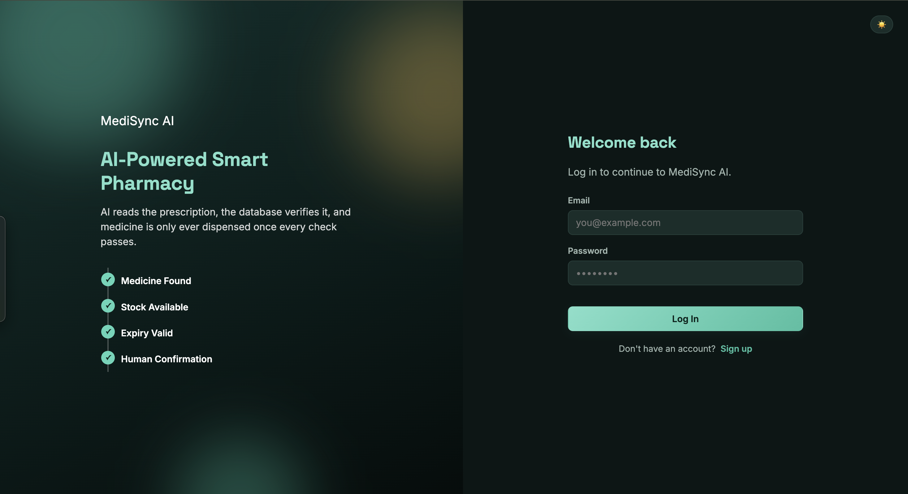
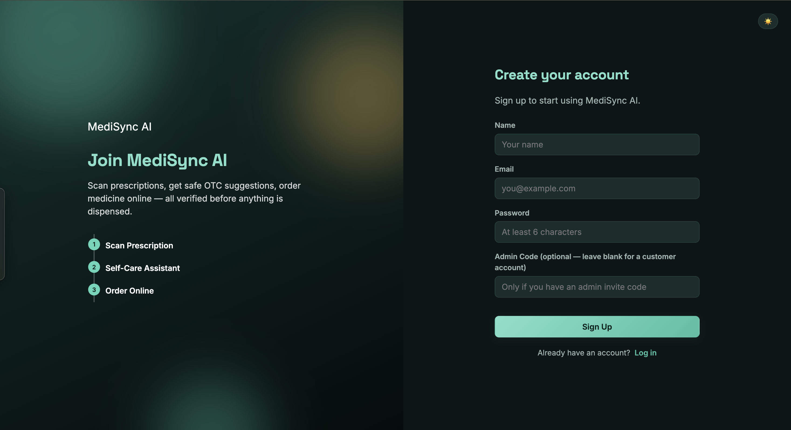
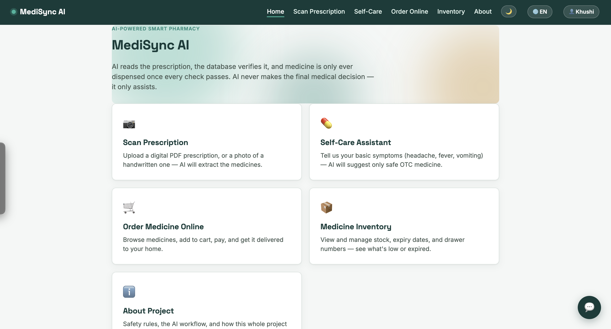
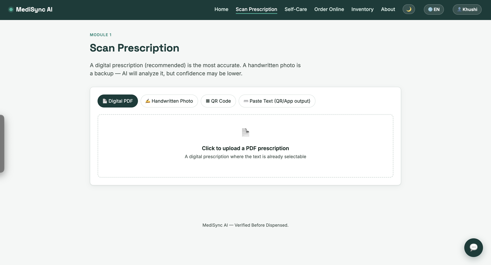
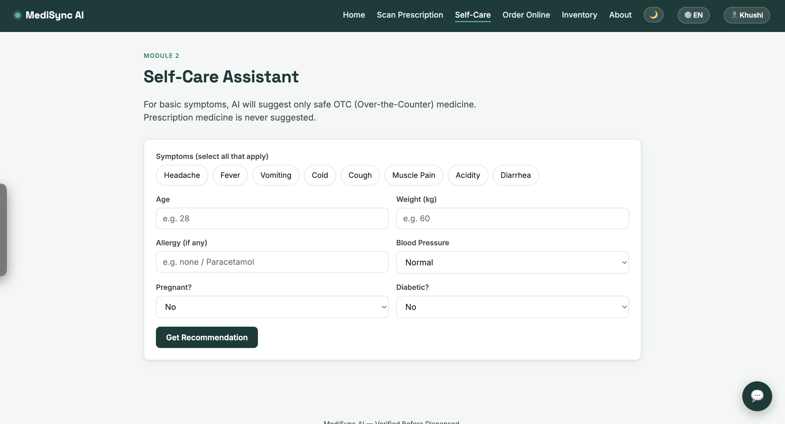
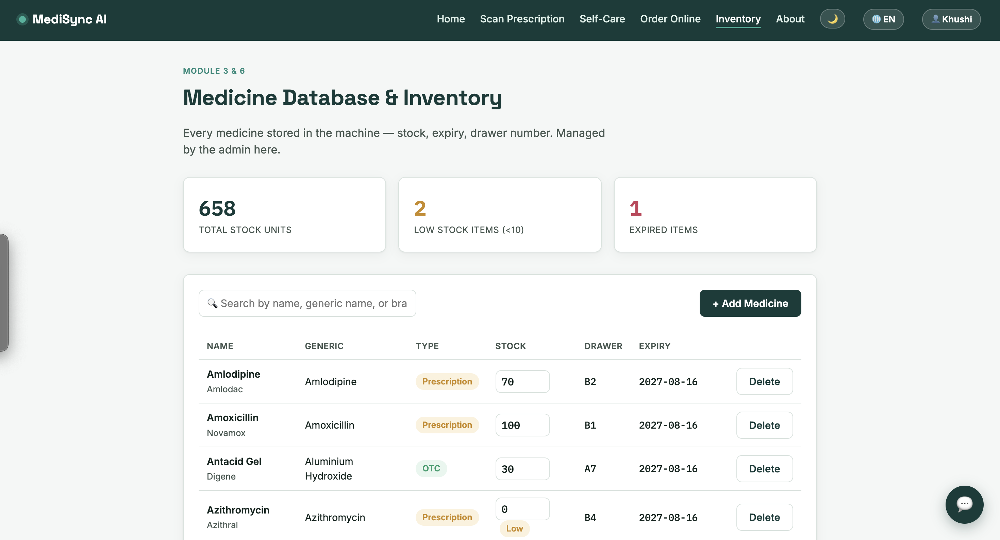
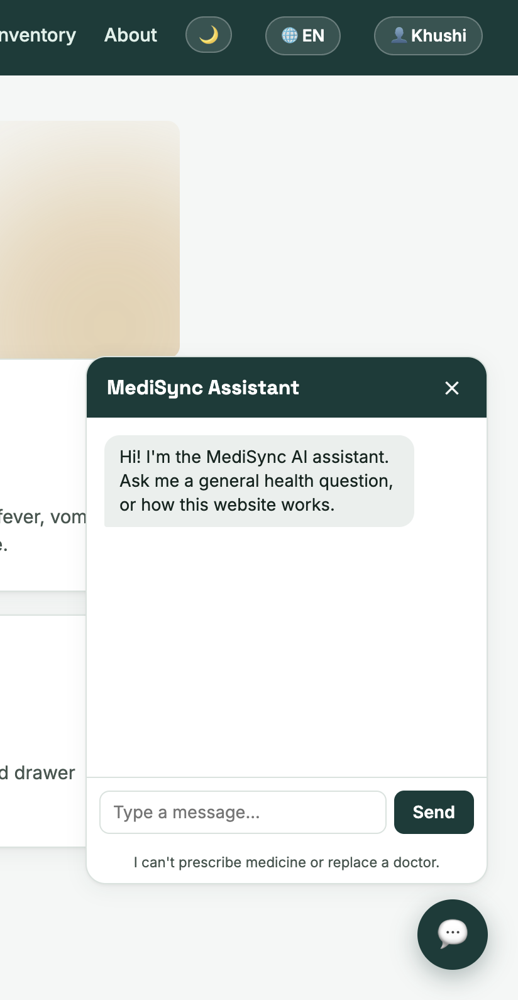
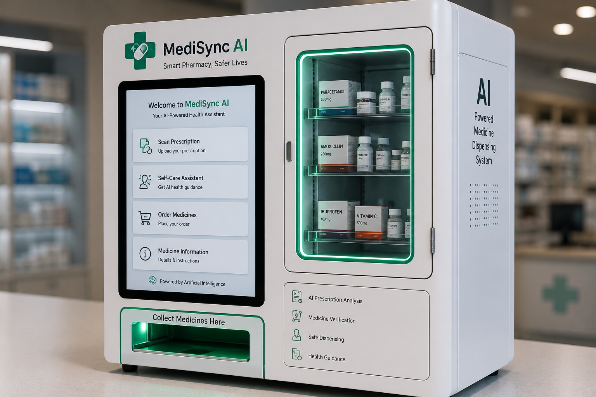

# MediSync AI

**AI-Powered Smart Pharmacy & Prescription Management System**

MediSync AI is an AI-assisted healthcare platform that simplifies prescription processing, medicine verification, inventory management, and pharmacy automation. The platform combines AI-powered OCR with secure verification to improve healthcare accessibility, efficiency, and patient safety.

---

## Features

- AI-powered Prescription OCR
- Handwritten, Printed, PDF & QR Prescription Support
- Medicine Verification Engine
- Online Medicine Ordering
- Medicine Inventory Management
- AI Health Chatbot
- OTC Self-Care Assistant
- Secure Authentication (Admin & Customer)
- Multi-language Support
- Dark / Light Mode

---

## Upcoming Features

- Doctor Appointment Booking
- Pathology & Lab Test Booking
- My Health Records Dashboard
- Medicine & Appointment Reminders
- Doctor & Lab Admin Portal
- Cloud Health Records
- Online Payment Gateway
- AI-Powered Smart Medicine Dispensing Machine

---

## Technology Stack

| Category | Technologies |
|----------|--------------|
| Frontend | HTML, CSS, JavaScript |
| Backend | FastAPI (Python) |
| Database | SQLite |
| AI | Google Gemini API |
| Deployment | Render |
| Version Control | Git & GitHub |

---

## Project Screenshots

| Login | Sign Up |
|--------|---------|
|  |  |

| Home | Prescription Scanner |
|------|----------------------|
|  |  |

| Self-Care Assistant | Inventory |
|---------------------|-----------|
|  |  |

---

## AI Chatbot

  

---

## Smart Medicine Dispensing Machine (Concept)

  

> **Note:** This image represents the conceptual design of the proposed AI-powered medicine dispensing kiosk. It illustrates the future hardware vision of the MediSync AI project.

---

## Project Documentation

**Project Proposal (PDF)**

📄 [Download Project Proposal](docs/MediSync_AI_Project_proposal.pdf)

**Detailed Project Documentation**

https://docs.google.com/document/d/1_ZxrJnsKeNOnPCR0dzQb1bvX01qvqQLY0p1hypX6B6s/edit?usp=sharing

---

## Future Vision

MediSync AI aims to become a complete AI-powered healthcare ecosystem by integrating:

- Smart Pharmacy Automation
- Robotic Medicine Dispensing
- Doctor Appointment Management
- Pathology & Lab Test Booking
- Digital Health Records
- Medicine & Appointment Reminders
- Cloud-Based Inventory Management
- Secure Online Payments

---

## Author

**Khushi Chandra**

B.Tech – Computer Science & Engineering

Motilal Nehru National Institute of Technology Allahabad
